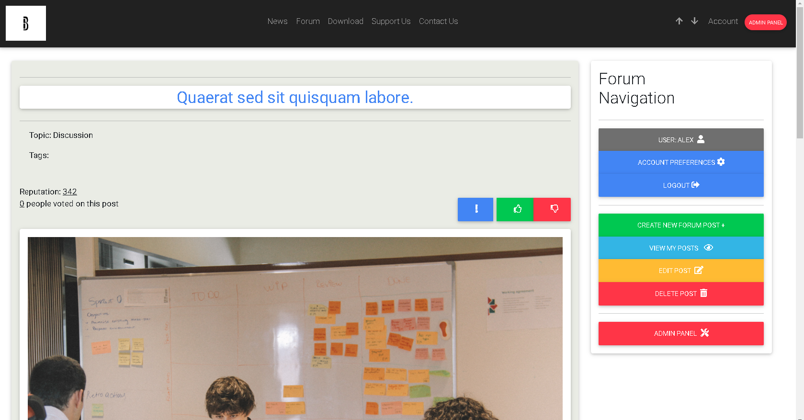

# BowstalCraft


## Description

This is a BowstalCraft! A website made on Django for your brand new minecraft server!

## Why?

I was having my own Minecraft server when I was young. Then, when I was studying high school, my thoughts were all about making a website for Minecraft server, where we can share information with players of the server.

## Quick-start

To successfully install BowstalCraft django website project on your machine, you will need python version 3.12.5 or higher. 

Check python version in command prompt:
```
python --version
```

**Don't forget to check if your python is in system path variable on Windows**

If you have the right python version, you can continue by installing virtual environment package with pip package manager. Open your command prompt and type this command:
```
pip install virtualenv
```

After you downloaded or cloned project, navigate to its folder (BowStalCraft-Website) and activate virtual environment by typing in command prompt:
```
python -m venv venv
```

**Important: the virtual environment name should be venv, otherwise you will have conflicts with paths in execution code below**

Then activate your virtual environment:
```
.\venv\Scripts\activate
```

Now run installation script:
```
python instalation.py
```

When everything is installed successfully, you can create test data to explore website functionality:
```
python manage.py create_test_data
```
**Password for all test user is:password123**

Launch the server:
```
python manage.py runserver
```
```
python manage.py runserver (optionally: type your address where you want the server to be launched for example: http://192.0.1.1:7400)
```

Navigate to http://127.0.0.1:8000/forum/, you should see something like this:


When you're done, you can stop the server by CTRL + BREAK and deactivate your virtual environment:
```
deactivate
```

## Usage

More advanced features of the website include:
- Creating, editing, viewing, deleting, real time voting for posts



- User Authentication and user editing profile


- Living comments under posts


